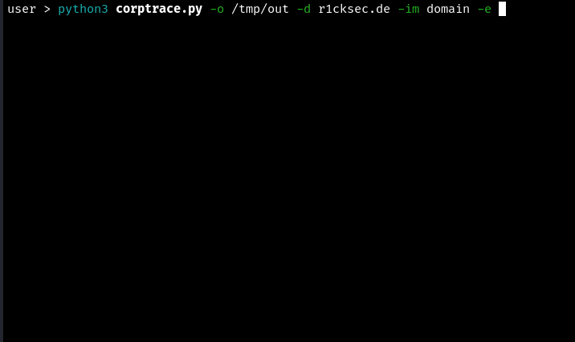

# CorpTrace

CorpTrace is a framewok that supports the process of collecting information about a target company in the context of a red team assessment.
I wrote this tool primarily to automate my workflow, so I'm sure it's still buggy for some cases.

## Usage

The core is the `modules.json` file, which contains the syntax for commands that will be executed.
It contains tools from other sources as well as some custom scripts.
Some of these modules require API keys. These keys can be stored in the `build/config.json` file.
<br>
<br>
Since CorpTrace calls multiple endpoints, repeated execution of the tool can lead to the IP address in used being blocked or the API keys being exhausted.
It is possible to obtain an overview of the consumption of the individual API keys using `ressources/scripts/print_api_keys.sh`.
<br>
<br>
Each module has its own risk level.
This level is made up of several factors, for example if the module sends several requests or if the module accesses the target company's infrastructure.
Executing CorpTrace with a high risk level and many simultaneous modules could have a negative impact on results.
<br>
<br>
Depending on the input, some modules may take very long to terminate.
To prevent timeouts of the individual modules, the duration of the timeout window can be adjusted during execution.
<br>
<br>
The following command executes all available modules for a domain up to risk level 2:

```
python3 corptrace.py -o /tmp/out -d r1cksec.de -e
```

## Install

The installation script was developed for Kali Linux.
Before running the installation, it is recommended to store API keys in the corresponding configuration file.

```
bash install.sh
```

To reinstall / overwrite all tools, the following argument can be specified.

```
bash install.sh -force
```

## Demo (2024)

Example of collecting data:



Example of the visualization of the collected data:


## Help
```
usage: corptrace.py [-h] -o OUTPUT [-e] [-v] [-p] [-g [{dark,light}]] [-to TIMEOUT] [-rl RISKLEVEL] [-ta THREADAMOUNT] [-em [EXCLUDEMODULES ...]]
                    [-im [INCLUDEMODULES ...]] [-a ASN] [-c COMPANY] [-d DOMAIN] [-f FILEDOMAINS] [-gu GITHUBUSER] [-gi GOOGLEID] [-i IPCIDR] [-n NAMESERVER]
                    [-r REPOSITORY]

Automate OSINT/Recon assessment.
Use at your own risk.

Basic usage:
Print matching modules for a given domain:
python3 corptrace.py -o /tmp/out -d r1cksec.de

Execute modules for given github user:
python3 corptrace.py -o /tmp/out -gu r1cksec -e

Print syntax of modules for given file containing domains:
python3 corptrace.py -o /tmp/out -f /tmp/domains -v

Only execute modules that contain at least one of the given substring in their name:
python3 corptrace.py -o /tmp/out -c 'companyName' -im shodan -e

Execute modules up to risk level 3, use 8 threads and increase timeout to 35 minutes:
python3 corptrace.py -o /tmp/out -rl 3 -ta 8 -to 2100 -i '192.168.1.1/24' -e

Print overview of results:
python3 corptrace.py -o /tmp/out -p

Generate graph based on dnsx_get_coherent_domains results:
python3 corptrace.py -o /tmp/out -g

options:
  -h, --help            show this help message and exit
  -o OUTPUT, --output OUTPUT
                        path to output directory
  -e, --execute         execute matching commands
  -v, --verbose         print full command
  -p, --print           print overview of results
  -g [{dark,light}], --graph [{dark,light}]
                        generate graph using dnsx_get_coherent_domains results
  -to TIMEOUT, --timeOut TIMEOUT
                        maximal time that a single thread is allowed to run in seconds (default 1200)
  -rl RISKLEVEL, --riskLevel RISKLEVEL
                        set maximal riskLevel for modules (possible values 1-4, 2 is default)
  -ta THREADAMOUNT, --threadAmount THREADAMOUNT
                        the amount of parallel running threads (default 5)
  -em [EXCLUDEMODULES ...], --exludeModules [EXCLUDEMODULES ...]
                        modules that will be excluded (exclude ovewrites include)
  -im [INCLUDEMODULES ...], --includeModules [INCLUDEMODULES ...]
                        modules that will be included
  -a ASN, --asn ASN
  -c COMPANY, --company COMPANY
  -d DOMAIN, --domain DOMAIN
  -f FILEDOMAINS, --filedomains FILEDOMAINS
  -gu GITHUBUSER, --githubUser GITHUBUSER
  -gi GOOGLEID, --googleId GOOGLEID
  -i IPCIDR, --ipcidr IPCIDR
  -n NAMESERVER, --nameserver NAMESERVER
  -r REPOSITORY, --repository REPOSITORY
```

## Modules

- crtsh_get_rootdomains
- csprecon
- dns_get_records
- dns_get_top_level_domains
- dnslytics_get_rootdomains
- dnsreaper
- dnstwist
- dnsx_get_coherent_domains
- git_get_secrets
- git_grep_commits
- github_get_organisation_member
- github_get_repositories
- github_search_accounts
- google_get_linkedIn_employees
- startpage_get_pdf_metadata
- gpg_get_emails
- grayhatwarfare_get_buckets
- hackertarget_get_rootdomains_from_cidr
- hackertarget_get_rootdomains_from_gid
- hackertarget_get_rootdomains_from_nameserver
- handelsregister_get_company_names
- hunter_get_emails
- massdns
- myssl_get_subdomains
- networksdb_get_company_names_from_domain
- networksdb_get_ipranges_from_company
- networksdb_get_rootdomains_from_cidr.py
- nmap_get_tls_alternative_names
- nmap_reverse_lookup
- northdata_get_company_names
- robtex_get_rootdomains
- securitytrails_get_ip_history
- shodan_get_ports_from_cidr
- shodan_get_rootdomains_from_company
- shodan_get_rootdomains_from_domain
- skymem_get_mails
- spk
- spoofy
- subdomaincenter_get_subdomains
- subfinder
- tmdb_get_company_names
- tomba_get_emails
- urlscan_get_rootdomains_from_company
- urlscan_get_rootdomains_from_domain
- urlscan_get_subdomains
- validin_get_rootdomains_from_cidr
- validin_get_rootdomains_from_domain
- whois_get_ips
- xing_get_employees
- zoomeye_get_rootdomains_from_domain
- whoxy_get_rootdomains

